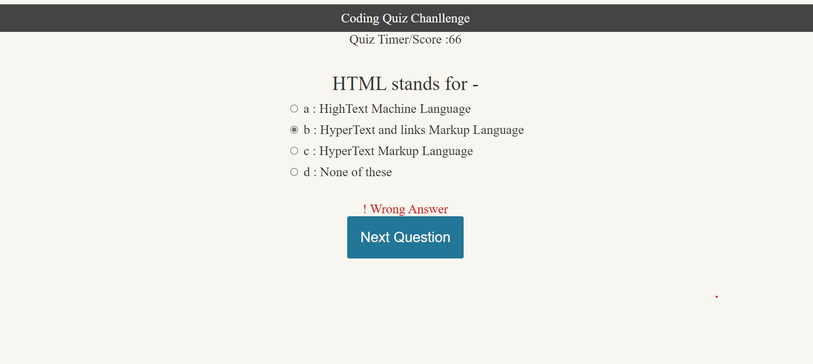
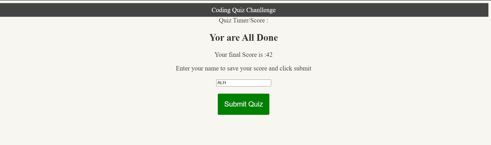

# javascriptquiz

1. Created folder structure and pushed the code to unique repo "javascriptquiz"  https://github.com/ashwinilh/javascriptquiz
2. Hosted the repo "javascriptquiz" on github live website with the URL-  https://ashwinilh.github.io/javascriptquiz/
3. This repo is for challenge 4 of UT boot camp to create html page with multiple choice question format.
4. Added 6 questions to the basic code.
5. Added timer to the code
6. Added begin button with necessary style and javascript
7. Added code for identifying correct answer
8. Added quiz timer
9. Updated the results div
10. Updated score in local storage
11. Updated showing high scores.

